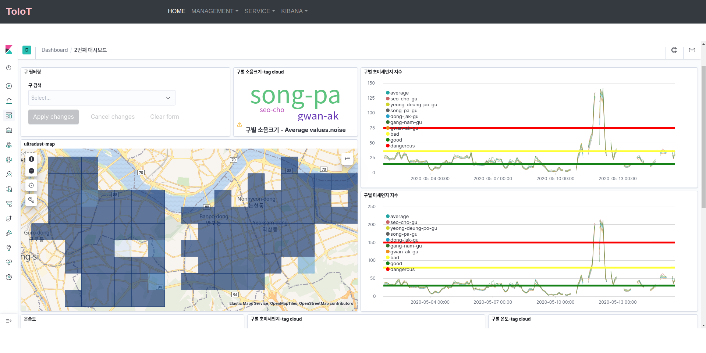
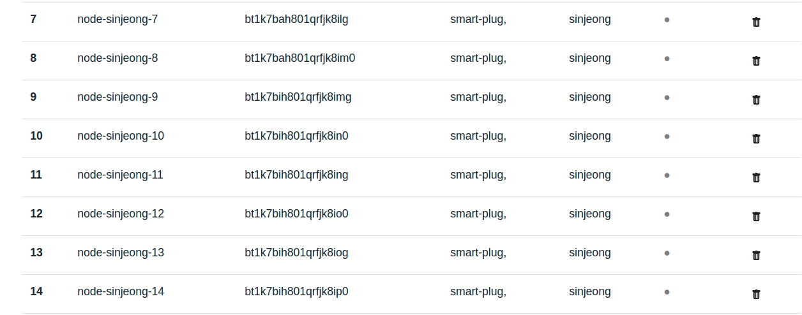
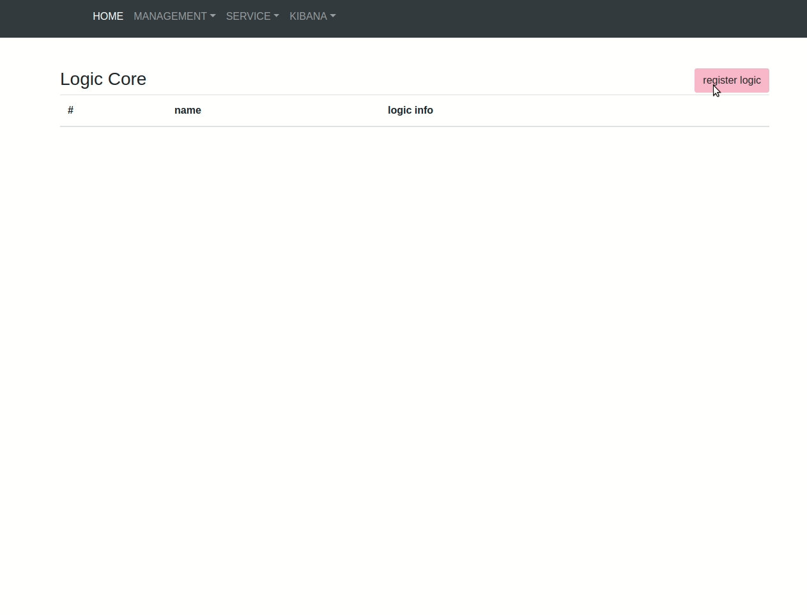
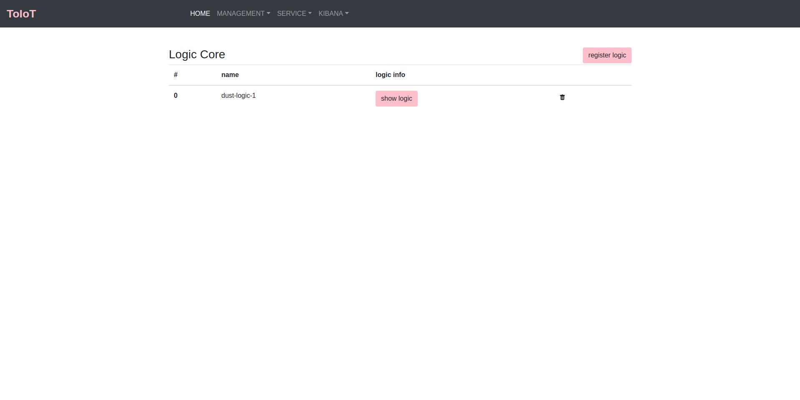
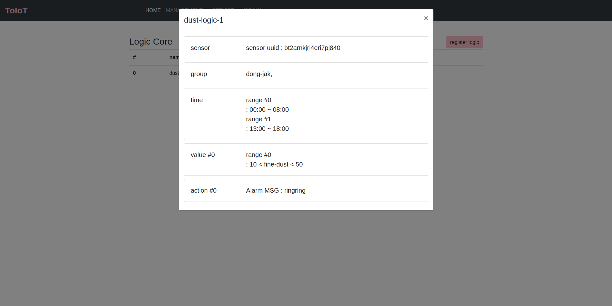
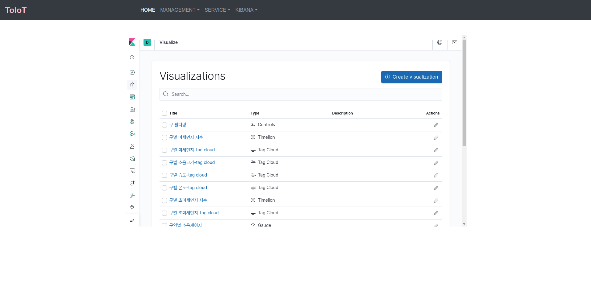
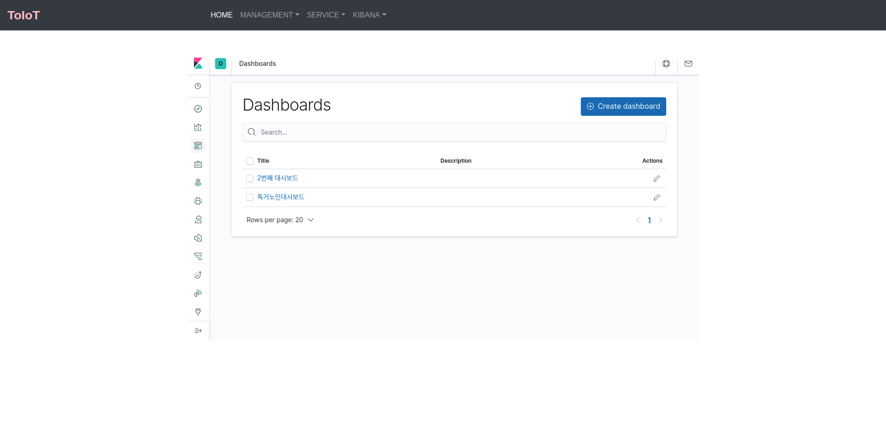

# User Interface by using react

# Table of contents

<!--ts-->

- [Introduce](#Introduce)
- [Setting](#Setting)
  - [Setting IP, PORT](#1.-Setting-IP,-PORT)
  - [Docker](#2.-Docker)
- [Execute](#Execute)
- [Structure](#Structure)
  - [Navigation bar](#1.-Navigation-bar)
  - [HOME](#2.-HOME)
  - [MANAGEMENT](#3.-MANAGEMENT)
  - [SERVICE](#4.-SERVICE)
  - [KIBANA](#5.-KIBANA)
  - [Alarm](#6.-Alarm)

<!--te-->

# Introduce

ToioT use typescript, html, css and react frame work.

# Setting

## 1. Setting IP, PORT

### 1.1. Solution 1 : environment variable

We recomment this solution then solution 2.  
Add `/PDK/ui/pdk-ui/.env.development` file for using kibana, connect with backend.  
For example..

```
REACT_APP_DB_IP=0.0.0.0
REACT_APP_DB_PORT=8080
REACT_APP_KIBANA_IP=0.0.0.0
REACT_APP_KIBANA_PORT=8080
REACT_APP_HEALTHCHECK_IP=0.0.0.0
REACT_APP_HEALTHCHECK_PORT=8080
REACT_APP_LOGICCORE_IP=0.0.0.0
REACT_APP_LOGICCORE_PORT=8080
REACT_APP_ALARM_IP=0.0.0.0
REACT_APP_ALARM_PORT=8080
REACT_APP_KAKAO_MAP_KEY=abcdefg12345678
```

### 1.2. Solution 2 : export variable

If you cannot solve the problem, do solution 2.
Modify `/PDK/ui/pdk-ui/src/defineUrl.tsx`.  
For example..

```typescript
import React from "react";
export const KIBANA_URL = "http://<KIBANA_IP>:<KIBANA_PORT>";
export const SENSOR_URL = "http://<DB_IP>:<DB_PORT>/sensor";
export const NODE_URL = "http://<DB_IP>:<DB_PORT>/node";
```

## 2. Docker

If you use docker, follow this solution.

### 2.1. Download Docker

1. Download Docker image  
   For example...
   ```shell
   docker pull iamhge/pdk-ui:0.1.1
   ```
2. Make docker-compose.yml
   For example...

   ```docker
   version: "3.2"

   services:
   pdk-ui:
       container_name: pdk-ui
       image: iamhge/pdk-ui:0.1.1
       ports:
       - "3001:3000"
       environment:
       - NODE_ENV=development
       - CHOIDAR_USEPOLLING=true
       - REACT_APP_DB_IP=0.0.0.0
       - REACT_APP_DB_PORT=8080
       - REACT_APP_KIBANA_IP=0.0.0.0
       - REACT_APP_KIBANA_PORT=8080
       - REACT_APP_HEALTHCHECK_IP=0.0.0.0
       - REACT_APP_HEALTHCHECK_PORT=8080
       - REACT_APP_LOGICCORE_IP=0.0.0.0
       - REACT_APP_LOGICCORE_PORT=8080
       - REACT_APP_ALARM_IP=0.0.0.0
       - REACT_APP_ALARM_PORT=8080
       - REACT_APP_KAKAO_MAP_KEY=abcdefg12345678
       stdin_open: true
       tty: true
   ```

3. Execute instruction. React will start.

   ```shell
   docker-compose up
   ```

4. Find your docker ip by type like next. You'll find the ip where the docker runs.
   ```shell
   ip addr | grep inet
   ```

# Execute

If you want to start react, execute this instruction at `/ui/pdk-ui`. After you execute instruction, enter `localhost://3000` in address.

```shell
npm install    // install dependency modules
npm run start  // start react
```

# Structure

All components are routed at `src/App.tsx`.  
`App.tsx` request nodeList, sensorList, sinkList and logicCore to backend, and pass on to lower components by props.


## 1. Navigation bar

Navigation bar is implemented so that each page can be entered.  
Used Compoponent : `src/Navigation.tsx`  


## 2. HOME

User can see Kibana Dashboard at here.  
Used Component : `src/Home.tsx`  


## 3. MANAGEMENT

`MANAGEMENT` tab's components consist of `Sensor`, `Node`, and `Sink` tab.  
Basically, components consist of sensor, node, and sink. User can manage each sensor, node, and sink at `MANAGEMENT` tab.  
These components are placed in `src/components` DIR.  


### 3.1. Sensor

Used Components : `src/components/SensorManagement.tsx`, `src/components/Register/RegisterSensor.tsx`, `src/components/Table/SensorTable`

#### SensorManagement.tsx

This component manage sensor tab.

#### RegisterSensor.tsx

User can register sensor by using this component.  
When user click `register sensor` button, a modal will show up.  
User enter sensor's informations( sensor name, sensor's values' name ).  
For example...  


- sensor name
- sensor's values : Sensor can have more than two values, so user can register all values' name.
- valid check
  1.  Did user enter the sensor name?
  2.  Did user enter more than a value name?

#### SensorTable.tsx

User can see sensors' informations.  
User can delete sensors by click wastebasket img.  


### 3.2. Node

Used Components : `src/components/NodeManagement.tsx`, `src/components/Register/RegisterNode.tsx`, `src/components/Table/NodeTable`

#### NodeManagement.tsx

This component manage node tab.

#### RegisterNode.tsx

User can register node by using this component.  
When user click `register node` button, a modal will show up.  
User enter node's informations( node name, group, location, sensors, sink ).  
For example...  


- node name
- group : The group of nodes is then used to group when registering logics. (e.g.location info(Seoul, Busan, ...))
- location : User should type latitude and longitude.
- sensors : User should select sensors which want to make belong to this node.
- sink : User should select sink which want to connect.
- valid check
  1.  Did user enter the node name?
  2.  Did user enter the group?
  3.  Did user select more than a sensor?
  4.  Did user select the sink?

#### NodeTable.tsx

User can see nodes' informations.  
User can delete nodes by click wastebasket img.  


User can check nodes' health by color immediatly. Each color represent state of nodes.  


### 3.3. Sink

Used Components : `src/components/SinkManagement.tsx`, `src/components/Register/RegisterSink.tsx`, `src/components/Table/SinkTable`

#### SinkManagement.tsx

This component manage sink tab.

#### RegisterSink.tsx

User can register sink by using this component.  
When user click `register sink` button, a modal will show up.  
User enter sink's informations( sink name, location, ip:port ).  
For example...  


- sink name
- location
- ip:port : User should type sink's ip:port info.
- valid check
  1.  Did user enter the sink name?
  2.  Did user enter valid ip:port?

#### SinkTable.tsx

User can see sinks' informations.  
User can delete sinks by click wastebasket img.  


## 4. SERVICE


### 4.1. Logic Core

`SERVICE` tab's component is only `Logic core` yet.  
Components of this are placed in `src/LogicCoreComponents` DIR.  


Used Components (major) : `src/LogicCoreComponents/LogicCoreManagement.tsx`, `src/LogicCoreComponents/RegisterLogic.tsx`, `src/LogicCoreComponents/LogicCoreTable.tsx`

#### LogicCoreManagement.tsx

This component manage Logic Core.

#### RegisterLogic.tsx

User can register logic by using this component.  
When user click `register logic` button, a page will show up.  
User enter logic's element( logic name, sensor, groups, time scope, value scopes, actions ).  
Each element is considered as card at this page.  
For example...  


- logic name
- sensor : A logic should be registered with a sensor.
- group : These groups are that user enters at registering nodes.
- time scope : User sets time scope when this logic does action.
- value scope : User sets value scope when this logic does action.
- action : User sets action which user wants this logic to do.
- valid check
  1. Did user enter the logic name?
  2. Did user select sensor?
  3. Did user set more than a action.

Used Components : `InputActionCard.tsx`, `InputGroupCard.tsx`, `InputSensorCard.tsx`, `InputTimeCard.tsx`, `InputValueCard.tsx` in `/src/LogicCoreComponents/InputCards` DIR

- Value card and action card can be multiple.
- Value card and time card can have multiple scopes.

#### LogicCoreTable.tsx

User can see logic core here.  
User can delete logics by click wastebasket img.  


User can see logic's structure by click `show logic` button.  


Used Components : `ShowActionCard.tsx`, `ShowGroupCard.tsx`, `ShowSensorCard.tsx`, `ShowTimeCard.tsx`, `ShowValueCard.tsx` in `/src/LogicCoreComponents/ShowCards` DIR

## 5. KIBANA

User can make and control visulization.


### 5.1. Visualize

User can make and control visulization.  


Used Component : `src/KibanaVisulize.tsx`

### 5.2. Dashboard

User can make dashboard.  


Used Component : `src/KibanaDashboard.tsx`

## 6. Alarm

Alerting alarm should be service all time, so this function is implemented by 'web socket'.  
This service can be registered by registering logic.

Used Component : `src/components/AlertAlarm.tsx`
